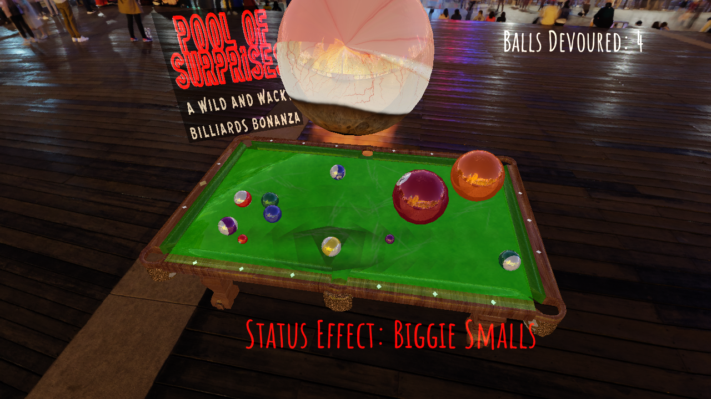

# Pool of Surprises

## A Wild and Wacky Billiards Bonanza


This project presents an alternative take on the classic game of pool/billiards. 

The user is able to launch the pool balls using a virtual cue stick, and resulting collisions among the balls are modeled realistically. Visual cues are also provided to help the user estimate launch trajectory. The game includes textures and environment cubemaps, with corresponding environment-mapped reflections implemented. 

Also implemented is an anomalous "fluid" on the table surface that reacts to the balls as they roll along it. Furthermore, an "Eye of Sauron" tracks the user and the ball most recently interacted with. Finally, the game physics are randomly tweaked in humorous ways, such as by causing some balls to hover, changing the sizes of some balls, making balls stick to the table edges, tilting the table, and subverting the expected launch direction of the balls.

Overall, this is a distinctive and fun offshoot of the traditional pool game, with unique features that make gameplay more dynamic.

## Demo

[](https://user-images.githubusercontent.com/54857948/235012640-3505d254-f479-4c57-bb24-c0b03ad7e1fc.mp4)





## Details

The PLYMesh class is used to represent the mesh data (positions, normals, UVs) of the game objects, including the pool table, pool balls, and cue stick. A struct data structure is used to store the position, velocity, rotation, color, and size of each ball in the game. A map from strings to booleans is used to keep track of the activation of different status effects.

The starting position of the balls is not in the usual triangular pool rack, but instead in a rose curve shape, described by k = 3 / 1, a = half of table width, theta = (ball index / number of balls) * pi, and r = a * cos(k * theta). I set the x-position of the ball at each index to r * cos(theta), and its y-position to r * sin(theta) in order to form this shape.

To create the vignette-based transition at the start of the game, I begin by coloring all pixels in an overlaid quad white, with alpha of 1.0. After some amount of time has passed, I calculate an alpha value for each pixel based on the distance between the pixel and the center of the screen. To create a smooth transition to the resulting vignette, I mix more and more of the new alpha value with the previous alpha value of 1.0 over time. I also have an intensity value for all pixels that starts at 1.0 and decreases smoothly across the entire image down to 0.0. By multiplying the product of the alpha and intensity by vec3(1, 1, 1) to get a final color, we get an effect where the image dissolves from white, with pixels that are further away from the center dissolving slower than those closer to the center.

When the game starts, and the user interacts with a ball, a launch detection algorithm takes the x and y position of the click and loops through all the balls to find the closest ball that is within the click area. To accomplish this, it converts the position of each ball from world coordinates to screen coordinates using the view and projection matrices before testing for 2D intersection.

To calculate the launch velocity of this closest ball, I start with the change in mouse coordinates vec2(-dx, dy). Since the user is able to move around the table, I also rotate this vector by the number of radians between the user and their initial position so that the ball is launched in the desired direction.

The game enables the user to estimate the trajectory of the ball before it is launched by drawing trajectory dots along the path given by the launch velocity of the ball. The trajectory dots are spaced further apart the further they are from the ball.

To have the balls roll along the surface of the pool table realistically, we update the rotation of each ball based on the distance it has traveled on the screen. The change in rotation during every frame is calculated by taking the distance the ball has traveled on the screen, and converting that to radians by multiplying it by 2 * pi / c, where c represents the circumference of the ball (one full rotation corresponds to one circumference). 

When two balls inevitably get too close to each other, a collision detection algorithm calculates the overlap distance between each pair of balls, and if the overlap is greater than 1, the two balls are moved away from each other by half the overlap distance along the normal vector between them. The velocities of the two balls are then updated by changing the component of the velocity that is in the direction of the collision normal. To do this, the velocity of each ball is projected onto the normal to get the normal velocity. The difference of the normal velocities of the two balls is then added to one of the balls and subtracted from the other to get final velocities.

When a ball approaches a table edge, a boundary detection algorithm checks whether the ball has gone beyond the threshold in either the x or y direction. If the condition is met, the algorithm adjusts the ball's position so that it is within the boundaries of the table and reflects its velocity in the appropriate direction. 

A pocket detection algorithm checks if a ball is sufficiently close to one of six pockets on the table. If the distance between the center of the ball and the center of the pocket is less than a certain threshold, the ball has sunk into the pocket. If the ball is close to a pocket but not close enough, its velocity is modified slightly such that it moves towards the pocket. If all 16 balls are sunk, the game ends.

To simulate friction, each ball's velocity is multiplied by 0.95 during every frame.

If the "Friction Affliction" status effect is on, each ball's velocity is multiplied by 0.75 instead of 0.95 so that its speed is reduced significantly during every frame.

If the "Sticky Situation" status effect is active and a ball hits a table edge, the ball's velocity in the reflected direction is set to zero instead of being reversed such that it sticks.

If the "Tilt-a-Table" status effect is on, either vec3(1, 0, 0) or vec3(-1, 0, 0) is added to each ball's velocity such that they all roll to one side of the table.

If the "Hover Havoc" status effect is on, the height of each ball in a random subset is changed from 0.0f to 50.0f + 10 * sin(elapsedTime()), such that the balls float over the table, moving smoothly up and down with time.

If the "Biggie Smalls" status effect is on, each ball from a random subset is made to either be three times its size or half its size. Their positions are also adjusted accordingly such that their lowest points still lie on the table.

If the "Get Gaslit" status effect is on, the y-direction of the ball being launched is inverted so that aiming the balls towards the pockets is made more difficult.

The orientation of the "Eye of Sauron" is determined by the game state and modified using point billboarding. If the game is just starting, the most recently launched ball is moving slow enough, or if the game is ending, the eye is pointed at the user. Otherwise, the eye is pointed at the ball most recently interacted with. To set the eye orientation, the program first finds the vector pointing from the camera to the designated look-at position. This vector is then used to calculate two additional vectors using cross product, one perpendicular to the up vector and the look-at vector, and the other perpendicular to both of the first two vectors. These three vectors are then used to create a rotation matrix, which is applied to the eye. The logo is also oriented in this way, but unlike the eye, it is set to face the user at all times.

For the "fluid" effect on the table surface, a shader calculates each pixel's position in UV coordinates, as well as the position of the ball most recently interacted with in UV coordinates. It then iterates over a 2D grid of quad positions, calculating for each pixel the shortest distance between it and the line segment between the quad position and the ball position. To find this shortest distance, we project the pixel position onto the line segment, then subtract the projected position from the original pixel position. If the projected position is far enough away from the ball, however, we set the shortest distance to 0.5 to give a steep cutoff. The color c1 of the pixel is initialized to black, and for each quad position, it is updated by mixing it with a new color c2 based on the above stated shortest distance. The greater the distance is, the closer the final color will be to the original value of c1 (black). The color c2 itself is a shade of green with its intensity determined by the length of the line between the quad position and the ball (longer is brighter), as well as the sin of time for a breathing effect.

## How to build

*Windows*

Open git bash to the directory containing this repository.

```
pool-of-surprises $ mkdir build
pool-of-surprises $ cd build
pool-of-surprises/build $ cmake ..
pool-of-surprises/build $ start pool-of-surprises.sln
```

To run from the git bash command shell, 

```
pool-of-surprises/build $ ../bin/Debug/pool-of-surprises.exe
```

*macOS*

Open terminal to the directory containing this repository.

```
pool-of-surprises $ mkdir build
pool-of-surprises $ cd build
pool-of-surprises/build $ cmake ..
pool-of-surprises/build $ make
```

To run the program from build, you would type

```
pool-of-surprises/build $ ../bin/pool-of-surprises
```

## Credits

- "Pool Table" (https://skfb.ly/oCIBB) by Jayden Miles is licensed under Creative Commons Attribution (http://creativecommons.org/licenses/by/4.0/).

- "Cue stick (LP)" (https://skfb.ly/6ASFq) by afferu is licensed under Creative Commons Attribution-ShareAlike (http://creativecommons.org/licenses/by-sa/4.0/).

- "Pool Balls" (https://www.robinwood.com/Catalog/FreeStuff/Textures/TexturePages/BallMaps.html) by Robin Wood

- "Eye" (https://skfb.ly/RJG7) by germydan is licensed under Creative Commons Attribution (http://creativecommons.org/licenses/by/4.0/).

- "Shanghai Bund" (https://polyhaven.com/a/shanghai_bund) by Greg Zaal is licensed under Creative Commons Attribution (https://creativecommons.org/publicdomain/zero/1.0/).

- Sound effects (https://www.soundfishing.eu/)

- Music (https://www.youtube.com/watch?v=TVlgG-Kil1Y) (https://www.youtube.com/watch?v=xlAFxo3el8Y) 
